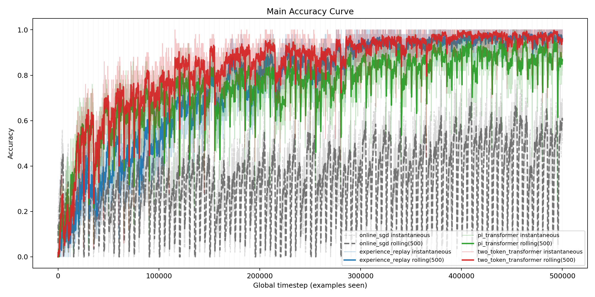
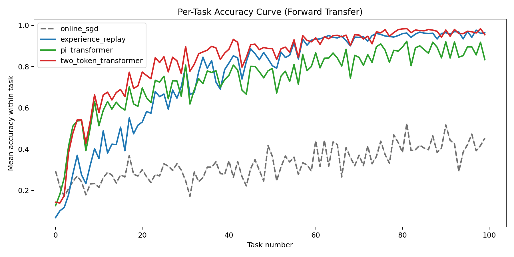
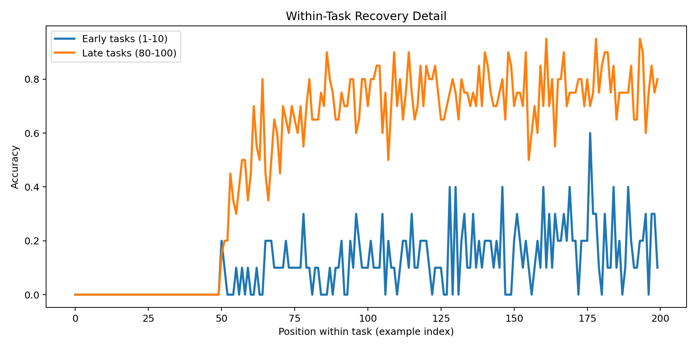
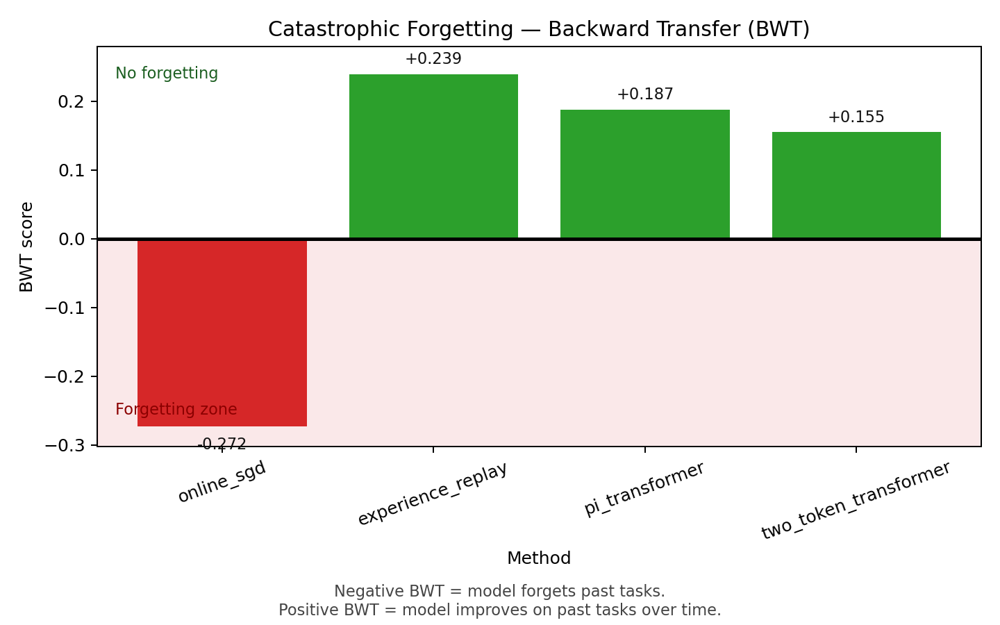

# transformer_online_continual_learning

Experimental reproduction and analysis of **Transformers for Supervised Online Continual Learning** on CIFAR-100 (piecewise-stationary online stream), with two tracks:

- **Pretrained/Frozen features** (`outputs/pretrained/*`)
- **Joint VGG++ training** (`outputs/vgg_plus_plus/*`)

## 1. Introduction

Continual learning is appealing because it matches real applications: data arrives over time, the model must keep predicting and adapting, and the distribution can change. This setting is hard because of **catastrophic forgetting**: when new tasks arrive, old knowledge is overwritten.

Transformer models are strong sequence learners and show strong **in-context learning**: they can use recent context instead of relying only on stored weights. The paper by Bornschein et al. asks whether this can solve supervised online continual learning and shows that combining **in-context learning**, **in-weight learning**, and **replay streams** gives large gains over prior baselines.

Primary source paper (this repository replicates this work):

- Bornschein, J., Li, Y., & Rannen-Triki, A. (2024). *Transformers for Supervised Online Continual Learning*. https://arxiv.org/abs/2403.01554

This repository is a **replication implementation** of the ideas from the authors above on CIFAR-100 under a piecewise-stationary protocol. It is **not a new paper** and does not claim a new core method:

- 100 sequential tasks
- 10 classes sampled per task
- 5,000 samples per task (with replacement)
- 500,000 online examples total
- chunk size 50 (10,000 optimization steps)

The central finding remains: memory-based methods (Experience Replay + Transformer variants) greatly outperform Online SGD, and Transformer methods show clear signs of forward transfer and meta-learning behavior.

## 2. Summary of the Paper

### 2.1 Problem Setting and Main Proposal

The paper studies fully online continual learning: predictions are made on a non-stationary stream, and updates happen continuously. The key objective is cumulative next-step prediction quality over time.

The core claim is that older methods rely too heavily on storing experience only in model weights. Transformer-based methods can do better by combining:

- **In-context learning**: conditioning on recent observations via attention + cache
- **In-weight learning**: continuous online SGD-style parameter updates
- **Replay streams**: revisiting past positions in parallel temporal streams

### 2.2 Why This Works

Replay streams force the model to generalize across the whole stream instead of overfitting to only the most recent state. Context attention supports fast adaptation when mappings shift, while weight updates accumulate long-term structure.

The main architecture, **Pi-Transformer**, injects past labels as privileged information into attention key/value paths while preventing leakage of the current target label.

### 2.3 Main Scientific Message

The strongest online continual learning systems should not rely only on gradient updates. The major gains appear when contextual memory and online weight learning are used together, with replay as the mechanism that stabilizes and reinforces long-term behavior.

## Reproduction Snapshots (VGG++ Track)

> Exported from `outputs/vgg_plus_plus/figures`.

### Main Accuracy Curve

### Per-Task Forward Transfer

### Within-Task Recovery

### Catastrophic Forgetting (BWT)

## Runbook

- Full run guide: [`docs/RUNBOOK.md`](docs/RUNBOOK.md)

## Reference

- Bornschein, J., Li, Y., & Rannen-Triki, A. (2024). *Transformers for Supervised Online Continual Learning*. https://arxiv.org/abs/2403.01554
